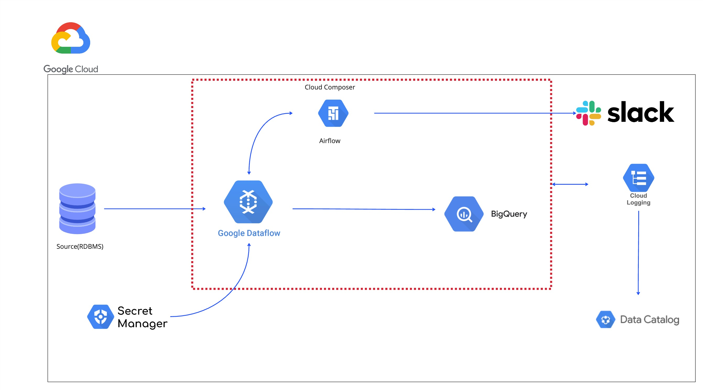
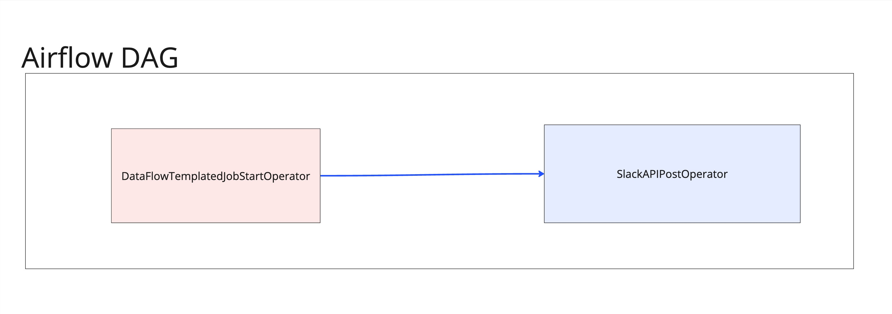
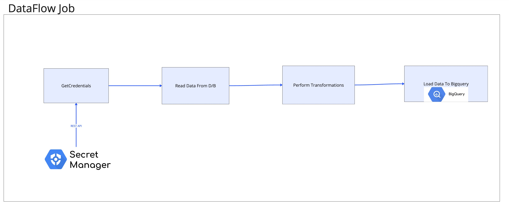

# ETL Pipeline Architecture on Google Cloud Platform (GCP)

## Architecture Overview

### Services Used
1. **Cloud Composer (Airflow)**: For Orchestration and Monitoring
2. **DataFlow**: For Data Processing
3. **BigQuery**: For Storing Data
4. **Cloud Logging**: Logging
5. **Secrets Manager**: Storing Credentials and Database URL
6. **Data Catalog**: For Data Governance

### Additional Services
1. **Terraform**: For Infrastructure Management
2. **GitHub**: For Version Control
3. **Google Cloud Storage**: For Storing DataFlow Template Job

## Working
Airflow Dag will be scheduled to run the Data Pipeline . The execution starts with Airflow Dag triggering a DataFlow Flex Template Job using DataFlowTemplatedJobStartOperator.
DataFlow Job will first get credentials such as database url , username ,password Stored in Google Secrets Manager.
It will then Read Data From Source(RDBMS) , transform the data , and Load the Data in Bigquery Table .
Based on the Dag Status , a Slack notification will be be sent out to a group , to inform about the status of pipeline.
Cloud Logging is Configured to capture logs from the entire Architecture for log analytics,auditing and sending out notifications for any anamoly in the Services.

## Scalability and Performance
This entire architecture is highly scalable and performant as we have used services such as Airflow on Cloud Composer, DataFlow, BigQuery for our pipeline, which are auto-scalable, highly performant to handle huge workload and fully managed by Google itself.

## Airflow DAG

There are only two tasks in airflow dag -
1. **ETL TASK**: It will trigger a flex templated dataflow job to perform etl operation using
    - Source: ON-Prem D/B
    - Destination: BigQuery Table

[Reference](https://cloud.google.com/composer/docs/how-to/using/using-dataflow-template-operator)

2. **Notification**: It will send out notification based on the status(Success/Failed) of the ETL Task to a slack channel
[Reference](https://airflow.apache.org/docs/apache-airflow-providers-slack/stable/_api/airflow/providers/slack/operators/slack/index.html#airflow.providers.slack.operators.slack.SlackAPIPostOperator)
## DataFlow Job

This DataFlow Job will be a flex template for version control, sharing, and triggering it.
The operations performed are as follows:
1. **GetCredentials**: This will be a Python function to get credentials and URL of the source stored in Google Secrets Manager for better security and management.
2. **Read Data From D/B**: This step will use the source DB as a source to read data from it and create a PCollection.
3. **Perform Transformations**: This step will use the existing PCollection as input and perform transformations on it.
4. **Loading to BigQuery**: In this final step, we will load the transformed data into a BigQuery Sink.

## BigQuery Schema
Create a DataSet in BigQuery named Warehouse with a table Customers with schema:
- `cust_id` (String)
- `favourite_product` (String)
- `longest_streak` (Integer)

## Bonus Questions
- **Monitoring**: Using Airflow for monitoring of Pipeline.
- **Logging**: Using Cloud Logging for logging the entire Architecture. Configuring Logging in the pipeline code using the Python logging module will help in adding more information such as metadata which can be leveraged for Data Governance.
[Reference](https://cloud.google.com/logging/docs)
- **Automated notifications**: AirFlow Task to send out Automated Notifications on Slack about the status of the Dag. Additionally, Configuring Cloud Logging for sending alerts to Slack.
- **Cost-effective**: This entire architecture is highly cost-effective because of the services used. BigQuery is very cost-effective for storing data, and DataFlow is serverless, which means we won't have to pay for creating a cluster; costs will be calculated based on the amount of time the resources were used by the job.
- **Scalable**: All the services used here are highly scalable, very capable, and battle-tested for handling huge loads.
- **Data Governance**: Utilize Data Catalog for data governance.

## Data Governance Implementation

### What is Data Governance?
Data governance refers to the overall management of the availability, usability, integrity, and security of data used in an organization. It involves establishing processes, policies, standards, and metrics to ensure that data assets are managed effectively and in compliance with regulatory requirements.

- **Data Catalog**: Utilize Google Cloud's Data Catalog service for data governance. Data Catalog provides a centralized and unified view of all data assets across the organization. It allows for the documentation, organization, and management of metadata about the data assets, including data lineage, data quality, and access controls.
- **Metadata Management**: Ensure that metadata about the data pipeline, including source data, transformations, and destination schema, is properly documented and managed within Data Catalog. This metadata helps in understanding the data flow, ensuring data quality, and enforcing data governance policies.
- **Data Lineage**: Document the end-to-end data lineage within Data Catalog, tracing data from its source in the RDBMS through the transformations performed by the DataFlow job to its final destination in BigQuery. This provides transparency and visibility into how data is transformed and used within the pipeline.
- **Access Controls**: Define and enforce access controls within Data Catalog to regulate who can access and modify the metadata and data assets. Use Google Cloud IAM roles and permissions to ensure that only authorized users have access to sensitive data and metadata.
- **Data Quality Management**: Implement data quality checks within the pipeline to ensure that the data being processed and loaded into BigQuery meets predefined quality standards. Document data quality metrics and rules within Data Catalog and regularly monitor and audit data quality using automated processes and tools.
- **Policy Enforcement**: Define and enforce data governance policies, such as data retention policies, data classification, and data masking, within Data Catalog. Use Data Catalog's integration with Google Cloud Policy Intelligence to automatically enforce policies and detect policy violations within the data pipeline.
[Reference](https://cloud.google.com/blog/products/data-analytics/data-governance-in-the-cloud-part-2-tools)