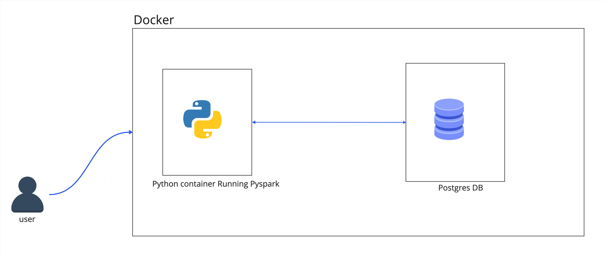

# ETL Pipeline for CSV to Postgres Database

## Overview

**Source** -> CSV file in the Docker container
**Destination** -> Customers Table in Warehouse database in Postgres


This repository contains code and instructions for an ETL (Extract, Transform, Load) pipeline to transfer data from a CSV file to a PostgreSQL database table.
The pipeline is implemented using Python, PySpark for transformations, and Docker for containerization.

## Architecture

### Infrastructure

The infrastructure consists of two Docker services:

1. **etl**: This service runs the ETL pipeline. It uses a Dockerfile (`Dockerfile.etl`) to create a container with Python 3.10 as a base image, installs Java 17, sets environment variables, installs dependencies such as PySpark 3.3.3 using Poetry as a package manager, and runs unit and integration tests during container startup. This setup simulates a production-level deployment environment.

2. **postgres**: This service uses the Bitnami PostgreSQL 13 image. It initializes a database named "warehouse" and creates user credentials ("u-postgres", "p-postgres"). Upon container startup, an `init.sql` script is executed to create necessary tables, including "customers" and "test_customers".

To spin up the infrastructure, run:

```
docker-compose up -d
```

### Code

The main pipeline code is located in `etl/etl/main.py`. This Python script accepts arguments for the source file path, destination database name, and table name for loading the data. It utilizes PySpark for data transformations and communicates with the PostgreSQL database to load the transformed data.

### Testing

Unit and integration tests are located in the `etl/tests` directory.

- **Unit Tests**: Located in `etl/tests/unit-test.py`, these tests verify the functionality of individual functions within the pipeline code using mock data in dataframes.

- **Integration Tests**: Located in `etl/tests/integration-test.py`, this test use a sample dataset (`data/test_datasets/test.csv`) to run the entire pipeline and validate its functionality. They also verify column headers and data types in the resulting PostgreSQL table.

To run tests:

```
docker-compose run etl python etl/tests/unit-test.py
docker-compose run etl python etl/tests/integration-test.py
```

## Usage

1. **Run the Pipeline**:

    ```
    docker-compose build
    docker-compose run etl python etl/main.py \
    --source data/transaction.csv \
    --database warehouse \
    --table customers
    ```

2. **Execute SQL in PostgreSQL**:

    ```
    docker-compose exec postgres psql --user postgres -d warehouse \
    -c 'select * from customers limit 10'
    ```

## Commands

- **Build the Docker services**:

    ```
    docker-compose build
    ```

- **Run Unit Test**:

    ```
    docker-compose run etl python etl/tests/unit-test.py
    ```

- **Run Integration Test**:

    ```
    docker-compose run etl python etl/tests/integration-test.py
    ```
- **Check for Integration Test data**:

    ```
    docker compose run etl python etl/tests/integration-test.py
    ```